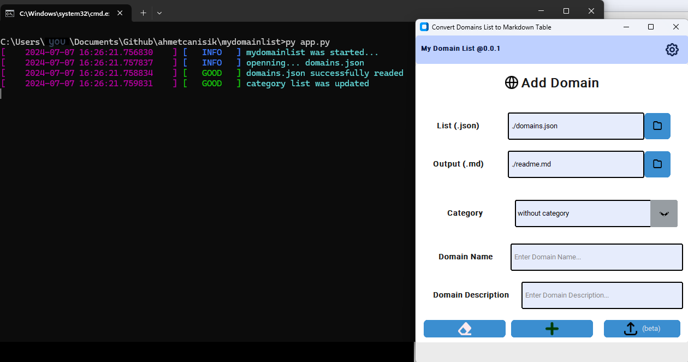

# My Domain List

> [!NOTE]  
> ⌚ The activity status of domain names was last checked on: `2025-07-15 11:56`   
> ❌ Purchased Domains : `1`      
> ✅ Available Domains : `1`      
> 👣 App Version : `0.0.1`

> [!TIP]  
> You can check out the notes for future releases [here](notes.md).

## Categories

- [My List](#my-list)
- [Without Category](#without-category)
  
## My List
| Domain Name | Description | Status |
|-------------|-------------|--------|
| <a href="https://whois.com/whois/example.com" target="_blank">example.com</a> | Domain name that is free to use in projects. | ❌ purchased |
## Without Category
| Domain Name | Description | Status |
|-------------|-------------|--------|
| <a href="https://whois.com/whois/star-this-project.me" target="_blank">star-this-project.me</a> | Your star rating for this project will motivate me. | ✅ available |

  

LICENSE: [MIT](LICENSE)